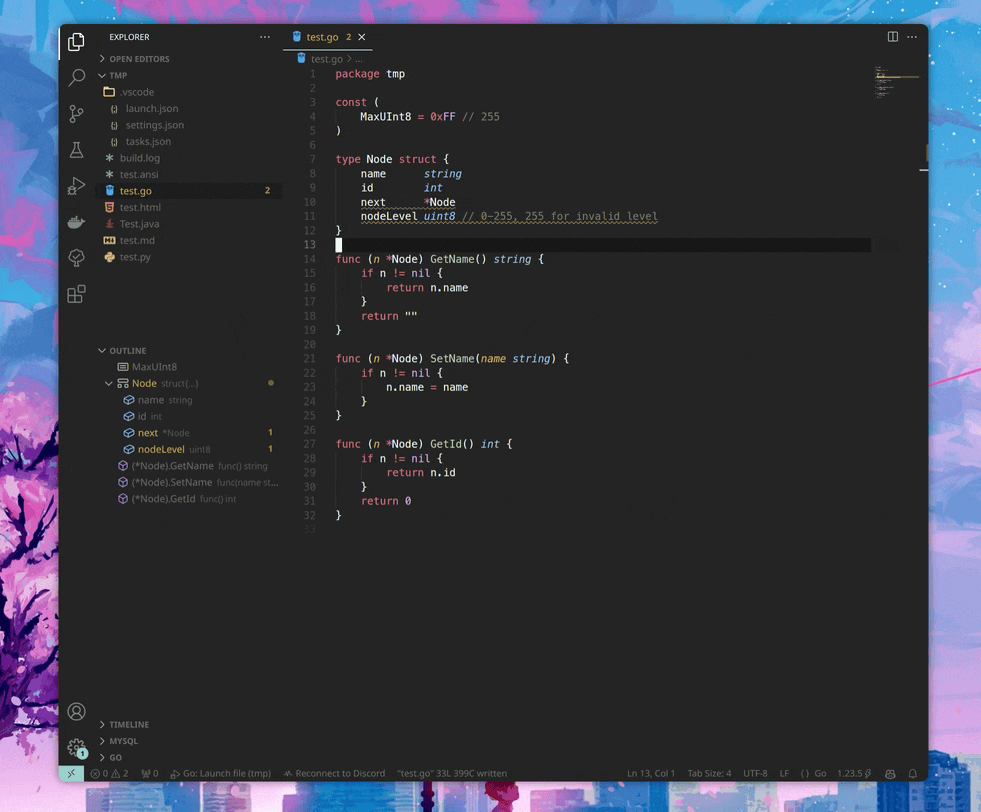

Go Source Action
===

[](https://github.com/xckomorebi/go-source-action/actions?query=workflow:Build)


This Visual Studio Code extension streamlines the generation of boilerplate code for Go structures.

It focuses on trivial code generation tasks like getters and setters, constructors, and interface stubs. More complicated tasks, such as handling nested struct, are out of scope for this extension.

This extension is inspired by [Language Support for Java(TM) by Red](https://marketplace.visualstudio.com/items?itemName=redhat.java).


QuickStart
===

There are multiple ways to trigger the code generation. For example, you can use `Source Actions` and select the desired action from the list:



Alternatively, you can use the command palette (e.g., `Go: Generate Getters and Setter`), or by right-clicking on the editor.

Requirements
===

[impl](https://github.com/josharian/impl) command has to be installed for "Gererate Interface Stub" feature.


Features
===

Generate Getters and Setters
---

Generates getters and setters for the fields of the structure with nil protection.

```go
type Foo struct {
    bar int
}

// following methods are generated
func (f *Foo) GetBar() int {
    if f != nil {
        return f.bar
    }
    return 0
}

func (f *Foo) SetBar(bar int) {
    if f != nil {
        f.bar = bar
    }
}
```

If no nil protection is needed, you can disable it in vscode settings.

```json
    "go.sourceAction.accessor.nilProtection": false
```
> Note: This feature is enabled by default.

```go
// following methods are generated
func (f *Foo) GetBar() int {
    return f.bar
}

func (f *Foo) SetBar(bar int) {
    f.bar = bar
}
```
 

Generate Constructors
---

Generates constructors for the structure.

```go
type Foo struct {
    bar int
}

// following methods are generated
func NewFoo(bar int) *Foo {
    return &Foo{
        bar: bar,
    }
}
```

Generate Interface Stub
---

Generates an interface stub for the structure.

```go
type Foo struct {
    bar int
}

// Foo implements io.Closer
func (f *Foo) Close() error {
	panic("not implemented") // TODO: Implement
}
```

This feature is originally provided by [vscode-go](https://marketplace.visualstudio.com/items?itemName=golang.Go) extension, and I made a tiny modification to omit the need to explicitly specify the receiver and struct name.

Extension Settings
===

This extension contributes the following settings:

* `go.sourceAction.accessor.nilProtection`: enable/disable nil protection for getters and setters, see [Generate Getters and Setters](#generate-getters-and-setters) for more details.
* `go.sourceAction.accessor.defaultValueForType`: user specified default value for types. When getters have nil receiver, this value is returned if the type of the field matches this config.

For example, if you don't want to return `""` for string fields, you can set this config like below.
```json
    "go.sourceAction.accessor.defaultValueForType": {
        "string": "consts.EmptyString",
    }
```

then the generated code will look like this.
```go
func (f *Foo) GetBar() int {
    if f != nil {
        return f.bar
    }
    return consts.EmptyString
}
```

License
===

This project is licensed under the GPLv3 license

see [GPLv3.0](LICENSE)

