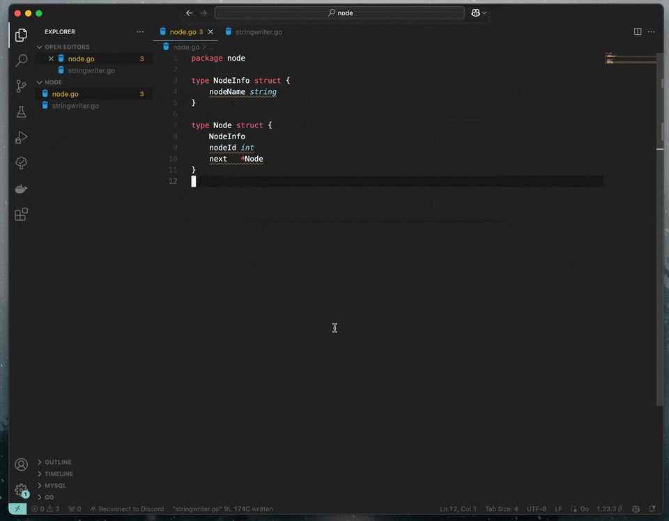

Go Source Action
===

This extension generates boilerplate code for Go structures.

It mainly focuses on trivial code generation tasks like getters and setters, constructors, and interface stubs. More complicated tasks like nested struct are not meant to be supported.

This extension inspired by [Language Support for Java(TM) by Red](https://marketplace.visualstudio.com/items?itemName=redhat.java).


## QuickStart

There's not much preparation needed to start using this extension.

Just open up a command palette and type a command (like `Go: Generate Getters and Setter`), then you are ready to go!



## Requirements

[impl](https://github.com/josharian/impl) command has to be installed for "Gererate Interface Stub" feature.


## Features

### Generate Getters and Setters

generates getters and setters for the fields of the structure with nil protection.

```go
type Foo struct {
    bar int
}

// following methods are generated
func (f *Foo) GetBar() int {
    if f != nil {
        return f.bar
    }
    return 0
}

func (f *Foo) SetBar(bar int) {
    if f != nil {
        f.bar = bar
    }
}
```

if no nil protection is needed, you can disable it in vscode settings.

```json
    "go.sourceAction.accessor.nilProtection": false
```
> Note: This feature is enabled by default.

```go
// following methods are generated
func (f *Foo) GetBar() int {
    return f.bar
}

func (f *Foo) SetBar(bar int) {
    f.bar = bar
}
```
 

### Generate Constructors

generates constructors for the structure.

```go
type Foo struct {
    bar int
}

// following methods are generated
func NewFoo(bar int) *Foo {
    return &Foo{
        bar: bar,
    }
}
```

### Generate Interface Stub

generates an interface stub for the structure.

```go
type Foo struct {
    bar int
}

// Foo implements io.Closer
func (f *Foo) Close() error {
	panic("not implemented") // TODO: Implement
}
```

this feature is originally provided by [vscode-go](https://marketplace.visualstudio.com/items?itemName=golang.Go) extension, and I made a tiny modification to omit the need to explicitly specify the receiver and struct name.

## Extension Settings

This extension contributes the following settings:

* `go.sourceAction.accessor.nilProtection`: enable/disable nil protection for getters and setters, see [Generate Getters and Setters](#generate-getters-and-setters) for more details.
* `go.sourceAction.accessor.defaultValueForType`: user specified default value for types. When getters have nil receiver, this value is returned if the type of the field matches this config.

For example, if you don't want to return `""` for string fields, you can set this config like below.
```json
    "go.sourceAction.accessor.defaultValueForType": {
        "string": "consts.EmptyString",
    }
```

then the generated code will look like this.
```go
func (f *Foo) GetBar() int {
    if f != nil {
        return f.bar
    }
    return consts.EmptyString
}
```

## Release Notes

has not been released yet.

## License

This project is licensed under the GPLv3 license

see [LICENSE](LICENSE)

**Enjoy!**
